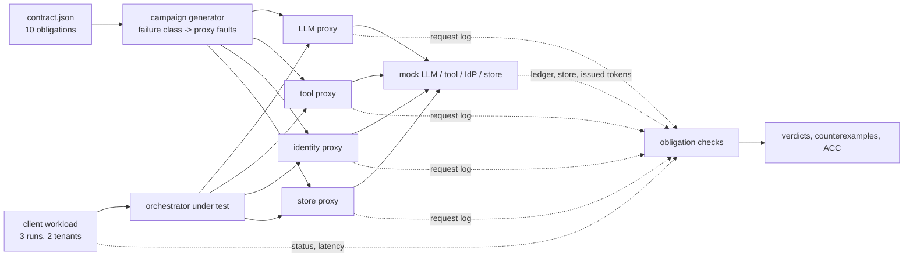

# CHAOS WITNESS

**Assurance-driven fault injection for agent platforms: which enterprise guarantees did this failure actually prove?**

An AI platform promises things: bounded retries, no duplicate refund when a tool call times out,
no cross-tenant token reuse during an identity outage, fail closed on garbage LLM output, an answer
within a deadline. A typical chaos test ("return 500 from the LLM, does it recover?") exercises a few
of these promises by accident and says nothing about the others. CHAOS WITNESS starts from a
declared **assurance contract**. For each obligation it generates the proxy faults that could falsify
it, runs them against the platform, and records a verdict from evidence the platform does not write:
proxy request logs, a side-effect ledger, the store, and client-side timing. The primary metric is
**Assurance Claim Coverage (ACC)**: the weight of obligations with at least one triggered, observed,
passing witness and no counterexample, divided by the weight of all required obligations. Obligations
the injector cannot express stay in the denominator.

> v0.1 research prototype. Runs locally on 127.0.0.1, with no cloud, no Docker, no LLM calls and no
> runtime dependencies. The platform under test is **synthetic** (mock LLM, tool, identity and store)
> and its weaknesses are planted. Every number below comes from
> [`reports/benchmark.md`](reports/benchmark.md), which the commands below regenerate in about 90 s.



## Evidence

Six campaigns were run against 9 builds of the platform: the hardened build, 7 single-weakness
mutants and an all-weak build. Each fault configuration drives 3 runs over 2 tenants. The full sweep
of the fault space is 108 single faults (9 kinds x 4 dependencies x 3 schedules), 972 isolated
executions. The seeded baselines are summarised over 200 seeds.

| Campaign | Fault configs | ACC, hardened | Planted weaknesses caught (all 7 caught) | False assurance |
|---|---|---|---|---|
| Manual chaos checklist (kill, slow, 500 per dependency) | 12 | 0.714 | 4/7 | 2 |
| HTTP 500 everywhere (every dependency x schedule) | 12 | 0.524 | 3/7 | 1 |
| LLM-API-only campaign (every fault x schedule on the LLM) | 27 | 0.429 | 4/7 | 0 |
| Random fault injection, same budget, 200 seeds | 30 | 0.804 mean | 6.48 mean (57.5% of seeds) | 0.485 mean |
| Ablation: same fault kinds, not aimed at obligations, 200 seeds | 30 | 0.804 mean | 6.345 mean (39.5% of seeds) | 0.615 mean |
| **Obligation-targeted campaign** | 30 | **0.809** | **7/7** | **0** |
| Exhaustive reference (every single fault) | 108 | 0.809 | 7/7 | 0 |

*False assurance* is the number of mutants on which the campaign reported the broken obligation as
**witnessed and passing**. Examples: the checklist kills the identity provider before any token is
cached, which "proves" tenant isolation on a build that leaks tokens. A 500 from the LLM "proves" fail-closed
behaviour on a build that acts on truncated LLM output. No campaign produced a false alarm (an
obligation falsified on the hardened build). Random injection needs roughly twice the budget to match
the targeted campaign: at 60 faults it catches all 7 weaknesses in 98.0% of seeds, and at 90 in 100%.

**What this does and does not show.**
- **ACC on its own barely separates the good campaigns.** Random at the same budget reaches the ACC
  ceiling in 95.0% of seeds. The measure that separates campaigns is falsification power against
  real weaknesses, and a cheap witness can inflate ACC. Read ACC together with the mutant results.
- **Targeted 7/7 and hardened-passes-everything are true by construction.** One author wrote the
  obligations, the failure classes and the planted weaknesses. What the study measures is how far the
  usual alternatives fall short, how much random budget closes the gap, and which part of targeting
  matters. The ablation keeps the fault kinds but drops the dependency and schedule targeting, and
  falls from 100% to 39.5% of seeds catching all 7. So the aim matters, not the fault vocabulary.

**Negative result.** Two of the 10 obligations (weight 4 of 21) cannot be witnessed by an HTTP fault
proxy. `token_expiry_under_clock_skew` needs control of the platform's clock.
`rollback_preserves_healthy_revision` needs a deployment control plane that the platform does not have.
They are reported as `unwitnessable` and cap ACC at 0.809 for every campaign.

Counterexamples found by the targeted campaign (fault config @ run):
`llm.http_500.all@r1` (unbounded retries), `llm.http_429.first@r1` (ignores Retry-After),
`tool.drop_response.first@r1` (duplicate refund), `identity.http_500.from2@r2` (globex's refund booked on
acme's token), `llm.truncate.all@r1` (acts on truncated output), `tool.timeout.first@r1` (no
deadline) and `store.http_500.all@r1` (200 without a stored result).

## Quickstart

Needs Python 3.10+.

```bash
python -m venv .venv && . .venv/bin/activate        # Windows: .venv\Scripts\activate
python -m pip install "pytest>=8"
python -m pytest -q                                  # ~25 s
python -m chaos_witness run --variant hardened       # exit 0: nothing falsified, ACC 0.8095
python -m chaos_witness run --variant no_idempotency_key --campaign manual_checklist   # exit 1
python -m chaos_witness bench --out reports          # the full study, ~90 s
```

`run` prints each obligation's status with its first counterexample or witness. It exits 1 if any
obligation is falsified, so it can gate a pipeline. Variants: `hardened`, `all_weak` and the seven
weaknesses below. Campaigns: `targeted`, `untargeted_ablation`, `random_same_budget`,
`manual_checklist`, `http_500_everywhere`, `llm_api_only`, `exhaustive`.

## How it works

- **Contract** ([`contract.json`](contract.json)). Each obligation has a statement, weight, scope (the
  dependencies involved) and the failure classes that could falsify it (`persistent_failure`,
  `transient_failure`, `throttle`, `ambiguous_outcome`, `mid_session_outage`, `malformed_response`,
  `slow`, `clock_skew`, `deploy_rollback`). JSON is valid YAML 1.2; it keeps the core stdlib-only.
- **Generator** ([`chaos_witness/witness.py`](chaos_witness/witness.py)). Each failure class maps to
  proxy faults with a schedule. `ambiguous_outcome` is drop-after-forward, duplicate delivery or a held
  response on the *first* call. `mid_session_outage` is an identity failure *from the second request
  on*, after another tenant's token could be cached. Faults are deduplicated across obligations; an
  obligation with no expressible fault gets a reason, not a silent skip.
- **Fault proxy** ([`chaos_witness/proxy.py`](chaos_witness/proxy.py)). One listener per dependency
  on a random free port, one scheduled fault, and a request log (run id, sequence number, fault
  delivered, forwarded or not, timestamps). Held and delayed requests are drained before evidence is
  read, so late "ghost" deliveries are always counted.
- **Platform under test** ([`chaos_witness/sut.py`](chaos_witness/sut.py)). An orchestrator gets a
  token, asks the mock LLM for a plan, calls an irreversible `refund` tool, and stores the result. The
  hardened build caps attempts at 3, honours Retry-After, sends an idempotency key, caches tokens
  per tenant and fails closed, retries then fails on unparseable LLM output, enforces a 0.6 s run
  deadline, and never acknowledges an unstored result. Each weakness flips one of these knobs.
- **Checks**. Each check has a precondition that must be visible in the evidence (for example "a tool
  request reached the tool and its reply was disturbed") and an invariant over the evidence (for
  example "at most one ledger entry for this run"). No precondition, no verdict. That is what
  *triggered and observed* means here.

### Failure taxonomy

| Fault kind | What the proxy does |
|---|---|
| `latency` | delays the request 1.5 s before forwarding |
| `http_500` | answers 500 without forwarding |
| `http_429` | answers 429 with `Retry-After: 0.3` without forwarding |
| `reset` | closes the connection without forwarding or answering |
| `timeout` | forwards, then holds the reply 1.2 s (past the hardened 0.25 s call timeout) |
| `drop_response` | forwards (the side effect happens), then closes without answering |
| `duplicate` | delivers the request upstream twice |
| `truncate` / `garble` | forwards, then returns half the body / the body with its quotes corrupted |

Schedules: `first` (1st request to that dependency only), `all`, `from2` (2nd request onward).

| Planted weakness | Knob flipped from the hardened build | Obligation it breaks |
|---|---|---|
| `unbounded_retries` | 8 attempts instead of 3 | `bounded_retry` |
| `ignores_retry_after` | fixed 20 ms backoff after a 429 | `honor_retry_after` |
| `no_idempotency_key` | no `Idempotency-Key` on the tool call | `no_duplicate_side_effect` |
| `global_token_fallback` | on IdP failure, reuse the last token of any tenant | `tenant_isolation` |
| `fail_open_on_bad_plan` | act on a default plan when LLM output is unparseable | `fail_closed_on_bad_llm_output` |
| `no_deadline` | 3 s per call, no run deadline | `bounded_latency` |
| `acks_before_durable` | answer 200 when the store write failed | `ack_implies_durable` |

## Enterprise bar: what the thesis needs

| Item | v0.1 decision |
|---|---|
| Retries, timeouts, idempotency, deadlines | required: they are the subject of the obligations |
| Identity / tenant isolation | required, mocked: a token service with per-tenant tokens; no real OIDC |
| Durable state | mocked store; durability means "acknowledged implies stored", not crash durability |
| Rollback | declared, and shown to be **unwitnessable** by this injector (negative result) |
| OpenTelemetry | not used. Proxy logs and ledgers are the evidence; OTel traces are the natural real-world source (v0.2) |
| CI, threat model | yes ([`docs/THREAT_MODEL.md`](docs/THREAT_MODEL.md)); actions pinned by SHA, read-only token |
| Policy-as-code, signed artifacts, Terraform, cloud integration tests | not required by the thesis; not built, not claimed |

## Prior art and what is not new

- **AgentChaos** (Tan et al., ASE 2026, [arXiv 2608.06790](https://arxiv.org/abs/2608.06790)) injects
  crash, omission and value faults into LLM API responses at the HTTP layer across 65 fault
  configurations, and measures task-success degradation. Its faults come from a fault taxonomy, not
  from declared obligations, and it targets the LLM API. The `llm_api_only` baseline here imitates
  that scope. It is not their tool.
- **Chaos engineering for LLM multi-agent systems** (Owotogbe, [arXiv 2505.03096](https://arxiv.org/abs/2505.03096))
  is a research agenda for injecting hallucination, agent and communication failures. The
  **Agentic NetOps/AIOps survey** ([arXiv 2605.12729](https://arxiv.org/abs/2605.12729)) argues for
  independently enforced assurance contracts but does not cover fault injection.
- **Choosing faults to falsify a stated correctness property is not new.** Lineage-driven fault
  injection (Alvaro et al., SIGMOD 2015, Molly) reasons backwards from correct outcomes with SAT. That
  is far stronger than the lookup from failure class to fault used here. **Checking properties from
  observed histories rather than from the system's claims** is Jepsen's method.
  **Filibuster** (Meiklejohn et al., SoCC 2021) systematically injects faults at every remote call
  site in tests.
- **Hypothesis-driven chaos** is standard practice: Chaos Toolkit's steady-state hypothesis,
  LitmusChaos probes, Gremlin, AWS FIS stop conditions, Chaos Mesh and Netflix ChAP. They run the
  experiments you write, with pass/fail probes. They do not derive the experiments from a contract,
  and they do not report coverage over a set of obligations. **ADA-ST**
  ([arXiv 2607.16161](https://arxiv.org/abs/2607.16161)) plans fault campaigns for coverage, but over
  fault-propagation graph edges, not obligations.
- **Toxiproxy** has most of these fault primitives. The proxy here is a small reimplementation that
  adds duplicate delivery and drop-after-forward. **agentic-chaos** (DeepAgentLabs, OSS) wraps
  LLM and tool calls with decorators, without an obligation mapping or a coverage metric.

The original novelty hypothesis ("turn architecture obligations into a generated campaign") is
therefore narrowed. What remains is an engineering contribution:
- a catalogue of AI-platform obligations (fail-closed on malformed LLM output, a single side effect
  under ambiguous tool outcomes, tenant token isolation during an IdP outage) bound to
  proxy-expressible failure classes;
- ACC with unwitnessable obligations kept visible;
- a measured comparison of campaign strategies against planted weaknesses, including how often
  generic campaigns produce false assurance.

## Limitations

- **Circular by design.** The platform, its weaknesses, the obligations and the failure classes were
  written by the same author. No real agent framework or real LLM/tool API was tested.
- **ACC does not grade witness strength.** On the hardened build, the first tenant-isolation
  witness `run` prints is `identity.http_500.all@r1`, which could not have failed. The generated
  campaign also contains a stronger one (`from2`), but ACC counts both the same. Mutation-graded
  witnesses would fix this (v0.2).
- Single-fault configurations only: no fault combinations, no concurrency (no races on idempotency
  keys), and a fixed sequential 3-run workload.
- Timing is scaled down: latency 1.5 s, hold 1.2 s, a 1.0 s latency obligation, and a fractional
  `Retry-After: 0.3`. Real servers send integer seconds.
- The evidence collectors share one Python process with the platform under test (see the threat model).
- Recovery time is not measured. Evidence completeness is 100% by construction, because every
  dependency is proxied and every request carries a run id; with real dependencies it would not be.
- Obligation weights are declared, not derived. The random baseline samples from this proxy's
  108-fault space; a larger fault space would favour targeting more.

## Layout

```
contract.json                 assurance contract: 10 obligations, workload
chaos_witness/proxy.py        fault-injecting HTTP proxy + request log
chaos_witness/sut.py          synthetic platform: mocks (evidence) + orchestrator (under test) + weaknesses
chaos_witness/witness.py      generator, baselines, execution, evidence checks, ACC
chaos_witness/bench.py        benchmark and report
reports/                      generated evidence (JSON + Markdown)
```

## Next (v0.2)

Mutation-graded witnesses, fault combinations and concurrent workloads, Toxiproxy as an alternative
backend, OpenTelemetry traces as the evidence source, clock and deployment fault injectors for the
two unwitnessable obligations, and a real agent framework as the system under test.

MIT licensed.
